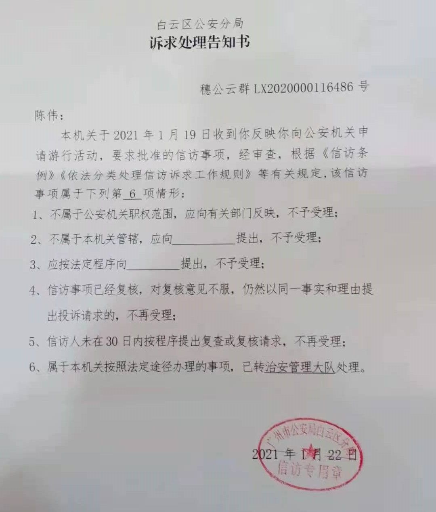

# 为维权而申请的游行

## 维权之路：从投诉无门到依法申请集会游行的艰辛历程

## 一、维权尝试的挫败

&amp;emsp;&amp;emsp;在遭遇消费陷阱后，我启动了一系列法定维权程序：先后拨打12315消费者热线和12345市民服务热线投诉，通过消费者协会小程序提交书面材料。当调解程序宣告失败时，我决定启动司法诉讼程序。随着调查深入，发现该事件并非个案，而是存在系统性侵权模式——在车辆上牌当日，我已偶遇同样在&#34;绿色出行&#34;购车的受害者，这印证了群体性受害的可能性。

## 二、申请游行的现实考量

&amp;emsp;&amp;emsp;在白云区公安机关多次报案未获立案后，基于两点核心考量决定依法申请集会游行：其一，通过公共事件关注度加速案件处理进程；其二，凝聚潜在受害者形成维权合力。特别注意到，过往未经批准的聚集事件参与者均被追究法律责任，因此严格按照《集会游行示威法》第九条规定，提前五日向主管机关递交书面申请。

## 三、行政程序中的制度困境

##### 2020年9月24日向广州市白云区公安分局递交完整申请材料，却遭遇双重制度障碍：

1. 行政效率问题：法定五日审批时限被实质延长至120天，远超《行政许可法》第四十二条规定的20日办理期限；
2. 程序瑕疵：2021年1月22日作出的行政决定未按《公安机关办理行政案件程序规定》第一百七十八条送达当事人现住址，反而径行寄往湖南户籍地，导致信息获取严重滞后。

## 四、程序正义的法治反思 本事件暴露出公民权利救济渠道的多重困境：

1. 投诉调解机制失灵：当行政调解难以解决复杂侵权纠纷时，缺乏有效的衔接机制；
2. 法定权利实现障碍：集会游行申请权受制于不透明的审批流程；
3. 执法程序形式化：文书送达等基础行政程序未能体现便民原则。

**&amp;emsp;&amp;emsp;这场历时半年的维权长征，不仅是个体权益的救济尝试，更是对法治政府建设的现实拷问。当程序正义遭遇执行偏差时，公民权利的实现需要制度性保障而非个人运气，这或许是我们走向成熟法治社会的必经之路**。

#### 附件：

1. **微信12315投诉截图视频**
   
   {{&lt; video &#34;/videos/315complaintsfeedback.mp4&#34; &gt;}}

2. **诉求处理告知书**
   
   

---

> 作者: [陈伟](https://blog.cwgzs.top)  
> URL: https://blog.cwgzs.top/posts/%E4%B8%BA%E7%BB%B4%E6%9D%83%E8%80%8C%E7%94%B3%E8%AF%B7%E7%9A%84%E6%B8%B8%E8%A1%8C/  

