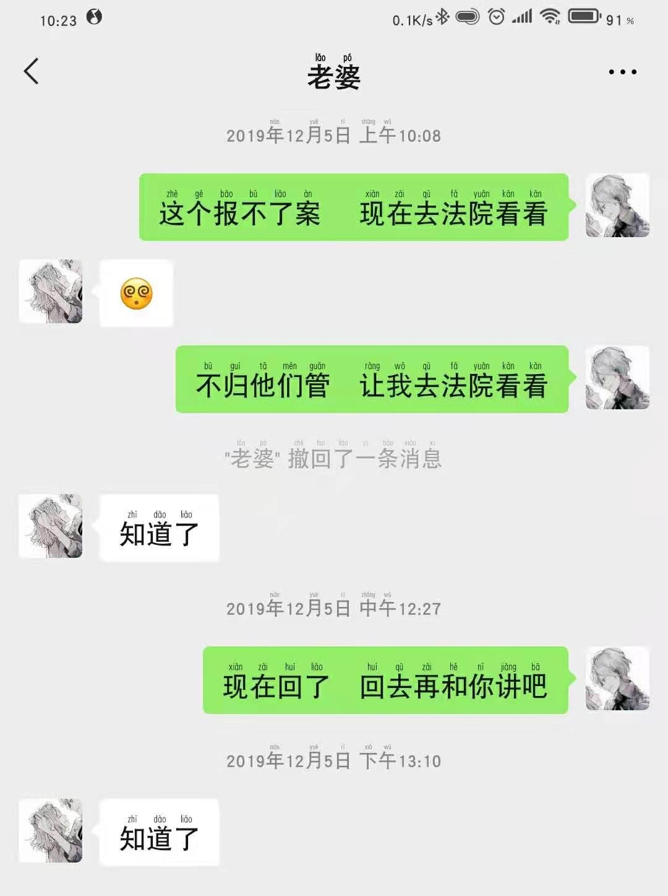
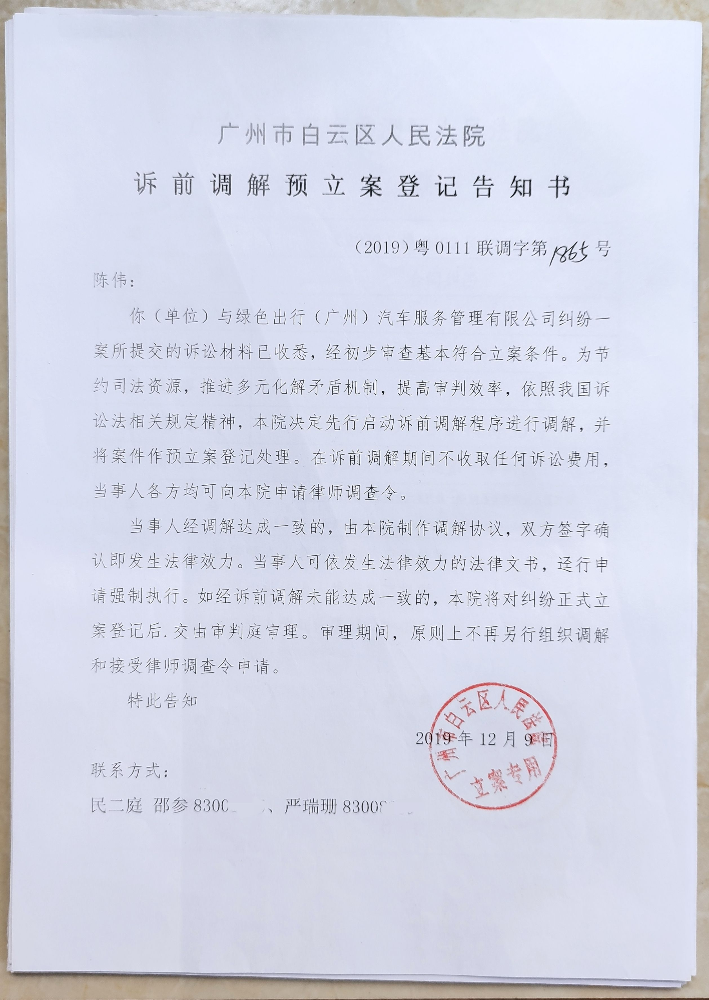

# 案件分析

### 这里写的是关于案件的分析，我发表我自己的一些看法

{{&lt; figure src=&#34;交首付尾款前.png&#34; caption=&#34;交首付尾款前&#34; &gt;}}

#### &amp;emsp;&amp;emsp;从我和我老婆的微信聊天记录来看，我在2019年11月15日上午去了对方的门店了解了一些情况，并要了我老婆的一些资料用来申请融资的一个情况。 同时也签订了那个“车辆销售定金合同”，定车合同我再放出来吧，合同上面有签订的时间

{{&lt; figure src=&#34;车辆销售定金合同.png&#34; caption=&#34;车辆销售定金合同&#34; &gt;}}

{{&lt; figure src=&#34;车辆销售定金合同 (2).png&#34; caption=&#34;车辆销售定金合同&#34; &gt;}}

### 这里开始下面是2019年11月16日的内容了

{{&lt; aplayer name =&#34;2019年11月15日13时15分45秒绿色出行财务&#34; artist =&#34;陈伟&#34; url =&#34;2019年11月15日13时15分45秒绿色出行财务.mp3&#34;  cover = &#34;&#34; lrc = &#34;2019年11月15日13时15分45秒绿色出行财务.txt&#34; &gt;}}

#### &amp;emsp;&amp;emsp;这一个是通话录音，在交了5000定金后回去等征信通知后，加了贷款业务员了解情况，对方发给我的一些信息和之前协商了解的情况完全不一样，然后绿色出行的人就打电话过来解释了

### 这里还是2019年11月15日的内容

[00:00.80]是啊喂

[00:01.50]喂 你好 陈先生 我是刚才绿色出行这边给你收单的何小姐 我想跟你说一下 你那个贷款是贷12万你的车身总价是15

[00:11.80]万多 对吧

[00:12.70]那你这边你那3万多块钱里面不是还有你的首付吗 你的总价是这么多告诉你 然后

[00:19.10]您这边的话 银行贷款 他是不是要有一个利益存贷呢

[00:25.00]这个利息太高了吧 我问下他的那个需要三个那个 那个那利息还要五利

[00:31.60]啊

[00:33.00]那你你这个你这个现在利息不就是央行的利息不都是44 9吗 那您这边的话一般都会有些个上浮 第一这个东西是

[00:42.90]您这个是一个车贷 他很多他都是有上浮的 你买房你都应该知道的 比如说你买房你应该知道 那这个也利息

[00:51.10]多少的话 那就是看银行的到底是多少 再再一个就是您那3万块钱 3万多块钱里面是不是还有含了你这个首付款

[01:00.40]你这个车的总价是15万多那你要贷十二万你

[01:05.30]总共 你加了这些的话 你要贷12万呢 你不贷款的话 你这个车你都想到贷款这12万这个车价做是12万吗 不可能的呀 所有的我们这边都帮你弄好

[01:15.90]你有什么不明白 之前业务员没跟你说吗 你这个是贷款买车

[01:19.80]但是你不是说全款这样子 整个车上你就你存贷一部分的费用啊 你这第一年的这些交强险呢 这个东西

[01:29.00]这个这个东西交强险的话 你都应该知道要几千块钱了 那个买保险了什么之类的呀 都已经含贷里面了运营险了

[01:38.60]这个 我知道 我今天想着 我想起来 我只是想知道那个费用的明细 因为你

[01:44.40]就好像我跟你说了 就好像我的方案表上面 我们的方案表上面写着 你这个车拿车 你只要交一

[01:52.30]你只要交12800你就可以拿车 你这个车里面是有交强险 运营险 车船税 gps

[02:00.10]招牌、牌照的使用费跟上牌费

[02:04.90]他这边都是说你贷12万有些是

[02:07.90]所有费用呢 你的车总的车价是15万多嘛 对吧 直接把那个费用明细让让那个

[02:17.90]加我微信的那个人直接编辑一下 发给我看一下 只要是明白了就没有问题

[02:23.20]我跟你讲第一现在这个明细是没有 为什么没有呢 第一现在是跟你审核

[02:28.50]你有没有这个资格贷这个款还是一个问题 所以说这些费用 这些明细是现在是给不出来的

[02:34.40]第一这个是在审核你 你能不能、你有没有、你能不能贷到这笔款是个问题 现在他都说我们这边金融跟您沟通

[02:42.20]就说我们走的这个金融是金融公司 不是直接对接银行的

[02:46.00]是金融公司这边 那他先跟你核实信息 核实信息之后就说你这个车你需要贷这么多钱 你才能够批下这个月供 这个月供按看这个下来

[02:56.60]因为我们这方案表上都有 这个车价是这么多 你有没有这个资格还是个问题 所以现在你想有什么明细是没有的

[03:03.40]这个没有是吧 对 现在第一你都还没有 你都都还 不知道你够不够这个资格来贷这个款 你都想所有的明细出来

[03:13.90]是没做的 最起码也要了解一下 要不然的话一下子出那么多 要是他过的话

[03:19.20]没有了这个这个不会不会忽悠你

[03:22.90]第一他做这个贷这个 他就都说 你现在拿这个车 你必须要贷 至少要贷这么多钱你才能够

[03:30.20]后续

[03:31.30]供那你这个车你要想一下 你交个1万多块钱 你就你12000多块钱 你就可以拿这个车说白了 你如果你自己去买车的情况下

[03:39.50]你你你的运费险 你的交强险了运营险了 车船税7788&#43;起来都要万多块钱了那等于说你这个车是你这个你这个是等于说你是

[03:50.60]不需要出钱

[03:51.80]可以默认为你不需要出钱 你就可以拿了一个车了 因为你去买一个车的话 你这些东西一年加起来都要万多块钱了

[03:59.70]我老公都是做这个的 我是很明白这一点的

[04:02.20]我懂的

[04:04.00]就包括你说你你你你为什为什么他这边是这样子的 第一你这个车拿下来的货厢是不是你得自己出钱做

[04:12.10]你明 你要明白这一点 货车的话 你去买车的话 他只是弄一家 他不含货厢的 还不含货厢的吗

[04:19.80]因为我在网上我 我知道第一我们现在拿给你的话是含货厢的 所以说整车给你弄好的 我的意思说如果你去4S 4S店去买车的情况下 到

[04:29.00]他是不含货厢的 货厢费用是得自己重新 另加上去了落地价什么之类的你这些你可以去这些你应该都很了解的

[04:38.70]行 那先这样吧 反正到时候要明细 我要看 要不然的话不明不白的要

[04:44.10]那你这边的话如果说你

[04:46.30]你这边额不配合这样子的话 那这边的话电审的话会出现问题 出现问题话那这边是批不下来

[04:53.80]就说有心做的话 我们就第一这个东西不是你针对你一个人 我们的方案表上上去 公司不是只针对你 是针对所有人的

[05:03.00]我是知道 如果说是批完之后 但就是过审了以后嘛 反正那些明细我都要有

[05:10.70]一说过 过完之后你要什么明细你也可以说

[05:15.80]就是我比如说你收的那些费用是什么的 他肯定有个收费明细吗

[05:19.80]对不对

[05:20.40]那到时候你叫你拿这个车的话 他会有一个比如说 你真心过了 你真心过了 你拿了车了拿了车 这个车必须要

[05:29.10]要有交强险才能让你上路 必须有买了保险他才能让你上路 你也必须买车船税 装了gps他才会交车给你 这些都会有

[05:38.10]这个我知道车船税 买车的时候就会

[05:41.80]把那个交强险的时候直接就是交管那里就直接交了 嗯嗯嗯就些我都知道 只是说那些明细费用 比如说

[05:51.00]你说你的意思 我交了这么多钱 对比如说我交了这些钱 你gps收了多少 然后车船税那些

[05:59.20]这些服务费啊什么的 对这些明细 这个服务费倒是应该是不会产生 现在是使用 你是一个牌照

[06:07.70]牌照使用这个额这个你放心 到时候我这边沟通一下额把那个明细

[06:12.60]给您这边弄出来 但是你这边一定要配合过电审 因为你这个东西审的没有审

[06:18.60]那你都有没有资格贷这个款 还是个问题 肯定要到后续才能你你这个车 你

[06:23.50]你确定要交了 交齐这个首付 这边一系列才会帮你买这个东西 你不交齐我们这边都不敢着手呀 我们买了 到时候这个东西不用

[06:33.00]不过我们放在这里给谁呀 对吧 你就知道了 这个东西大伙都应该是 成年人都应该是知道这回事了

[06:41.20]这个我知道 反正就是那个明细有 免得到时候不明不白的大家都不好

[06:45.00]对不对我 我知道这个东西肯定会有 肯定会有 去了多少到时候给你的单子上面都会写的呀 这个都不需要列明细 只要给到你单你就看吧

[06:55.00]这个单都是到时候都会给到你的

[06:57.20]行 那就到时候再说 都会给到你的 嗯是好 那你这边就先配合一下先做电审吧 电审出来之后再看 好不好

[07:06.50]嗯嗯嗯 好嘞 好嘞

### &amp;emsp;&amp;emsp;&amp;emsp;这里我放的是那个现场聊天录音的翻译字幕，也就是对录音文字化的一些内容

#### &amp;emsp;&amp;emsp;11月16日11点04分 手机录音 去了之后就问他要费用清单，了解后才决定有没有交钱确定要车。这个录音里面还录到了他们业务员和客户介绍的一些产品，其中就包括了我这个产品（买车提供货源）

{{&lt; aplayer name =&#34;11月16日11点04分&#34; artist =&#34;&#34; url =&#34;11月16日11点04分(录音设备1).mp3&#34; cover = &#34;&#34; lrc = &#34;11月16日11点04分(录音设备1).txt&#34; &gt;}}

[00:50.00]陈先生 还可以 坐 提车尾款 是吧 首付尾款昨天过了的那个福田

[00:58.60]去拿本子

[01:01.70]什么明细 那个收费明细啊 那个收费明细啊 那个要等你提车 帮你买个车险就才能出来的啊

[01:10.90]我也列 列不出个 正确数字给你啊 我现在网上看的是什么 那台车

[01:16.00]那台车指导价才10万 我怕你到时候别别搞个低配车当高配车卖给我

[01:22.00]那下面不是有吗 我们都是什么那 那信息上面有啊 我们的车是什么型号

[01:26.00]我们的车是什么型号 什么标配都有的呀 拿来看一下 嗯 你 你那个

[ 06:52.40]我说那资料怎么这么慢 昨天不是已经说了吗 我要看资料的

[10:35.80]怎么这么慢呢 昨天都跟他说了 我要看资料的啊

### &amp;emsp;&amp;emsp;&amp;emsp;等了好一会他们终于从楼上下来了，来两个人，这两个人和一开始就加我微信约我面试的人，都是贯穿整个案件的关键人物

##### 这个就是交首付尾款前对方和我解释价格组成的现场聊天记录（手机录音）

{{&lt; aplayer name =&#34;11月16日11点20分&#34; artist =&#34;&#34; url =&#34;11月16日11点20分(录音设备1).mp3&#34; cover = &#34;&#34;  lrc = &#34;11月16日11点20分(录音设备1).txt&#34; &gt;}}

[录音文本](/post/11月16日11点20分)

### 这里是2019年11月23日的内容

##### &amp;emsp;&amp;emsp;11月23日15点43分手机现场录音，因为提车我和我老婆两个人去的，就有两份一模一样的录音，录制起始时间不一样而已

{{&lt; aplayer name =&#34;11月23日 15点43分(录音设备1)&#34; artist =&#34;&#34; url =&#34;11月23日 15点43分(录音设备1).mp3&#34; cover = &#34;&#34; lrc = &#34;11月23日 15点43分(录音设备1).txt&#34; &gt;}}

### 2019年11月23日15点43分

[00:17.80]提车那边有

[00:20.90]给我发 发给我 没有 提车那边有 那不是我给你吗

[00:26.50]提车那边有 对

[00:30.00]提车 那我下等一下是指的是外面搞吗 对 我这会儿就去给你申请 你昨天买得那个保险 现在才跟我申请 没有这个

[00:39.40]你看我整理这个 那之前交了那个五千跟那个九千呢 五千跟那个九千 那个是车的首付

[00:49.00]但是我们不是零首付的吗 后面的金额都是零首付的那个

[00:53.10]你们是零首付 后面的总金额是有十四万多 是零首付的吗 不是吗

[01:03.40]4036 那个是零首付的

[01:10.70]我和金融那边已经说过了 ：对 已经核对过了 ：零首付 ：零首付那个方案是

[01:17.70]：我说了 我就是要那个费用清单拿过来啊 ：费用清单有什么费用吗

[01:22.10]：裸车 保险 上牌手续费 还没别的 没有的话 把那个钱都打出来 我看一下哪里有没有疑问的

[01:30.20]：那个的话是不是直接是就是你的发票价啊

[01:33.30]：现在每个车他都有一个发票价给你的啊 他有个发票给你的 对 ：有没有明细 ：那直接就是多少钱了啊 ：那肯定得有个明细啊

[01:43.80]：你买这个车 他哪里有个明细给你的 他只是拿给个发票给你 就是怎么说 不是说你要个明细给你吗 没有的

[01:53.40]：他是一张发票来的

[01:57.00]：之前我也说过的 买的时候 我也说过的 最开始交定金的时候 我也说过的哦 我要明细的哦

[02:03.40]：我问 ming姐 ming姐说她那边有 ：那就是 那就是在那边嘛 她有的话

[02:09.30]：是全部费用的哦 ：对啊 ：全部费用的 ：你现在觉得这个 你先去看吧 如果你觉得不满意 是吧

[02:17.90]：嗯 你再过来反映嘛 是不是 啊

### 2019年11月23日17点21分

### 提车和拿到提车清单后发现价格真的是“像一坨狗屎”

{{&lt; aplayer name =&#34;11月23日 17点21分(录音设备1)&#34; artist =&#34;&#34; url =&#34;11月23日 17点21分(录音设备1).mp3&#34; cover = &#34;&#34; lrc = &#34;11月23日 17点21分(录音设备1).txt&#34; &gt;}}

### 这一段译文从十几分钟开始 译文和时间会慢慢对不上

### &amp;emsp;&amp;emsp;&amp;emsp;发生矛盾之后下楼就打了报警电话，但是接警的说这个管不了。不属于管辖范围也就没有派警察过来了。我也放出来让大家听一下，报警记录和法律援助的记录

##### 这个是出来门口后报警的通话记录

{{&lt; aplayer name =&#34;110警匪2019年11月23日18时05分16秒&#34; artist =&#34;&#34; url =&#34;110警匪2019年11月23日18时05分16秒.mp3&#34; cover = &#34;&#34; lrc = &#34;110警匪2019年11月23日18时05分16秒.txt&#34; &gt;}}

##### 这个是根据指示打了法律援助的电话

{{&lt; aplayer name =&#34;12348法律援助&#34; artist =&#34;&#34; url =&#34;12348法律援助.mp3&#34; cover = &#34;&#34; lrc = &#34;12348法律援助.txt&#34; &gt;}}

### &amp;emsp;&amp;emsp;&amp;emsp;之后我又去了白云区公安分局去报案，连续去了两次都是不予立案，让我去人民法院那边咨询一下之后去公安报案

### 报不案了我就去了白云区人民法院了

## 这个是法院给的预立案调解告知书

## 最后想着再去聊一下看看，能解决的话就撤销起诉就好了

##### 这个是最后一次过去对方那里协商（这个是我老婆手机录的）

{{&lt; aplayer name =&#34;12月22日 14点25分(录音设备2)&#34; artist =&#34;&#34; url =&#34;12月22日 14点25分(录音设备2).mp3&#34; cover = &#34;&#34; lrc = &#34;12月22日 14点25分(录音设备2)&#34; &gt;}}

#### &amp;emsp;&amp;emsp;&amp;emsp;这个是我自己手机录的，因为手机发热中途关机，本段录音我是合并了前后两个录音的，和上面的录音基本一样，除了中间手机发热关机没有录到的那部分。下面的译文也是对应的这一个录音

## 2019年12月22日14点22分与15点06分录音设备1合并

{{&lt; aplayer name =&#34;12月22日 14点22分(录音设备1)截取合并&#34; artist =&#34;&#34; url =&#34;12月22日 14点22分(录音设备1)截取合并.mp3&#34; cover = &#34;&#34; lrc = &#34;12月22日 14点22分(录音设备1)截取合并.txt&#34; &gt;}}

[录音文本](/post/12月22日14点22分与15点06分)

- 这个译文我就不去掉前面部分的一些角色标名了，这个译文也是我申诉提交的完整译文

### 以下为12月22日15点06分

{{&lt; aplayer name =&#34;12月22日 15点06分&#34; artist =&#34;&#34; url =&#34;12月22日 15点06分(录音设备1).mp3&#34; cover = &#34;&#34; lrc = &#34;12月22日 15点06分(录音设备1).txt&#34; &gt;}}

[录音文本](/post/12月22日15点06分)

---

> 作者: [陈伟](https://blog.cwgzs.top)  
> URL: https://blog.cwgzs.top/posts/%E6%A1%88%E4%BB%B6%E5%88%86%E6%9E%90/  

